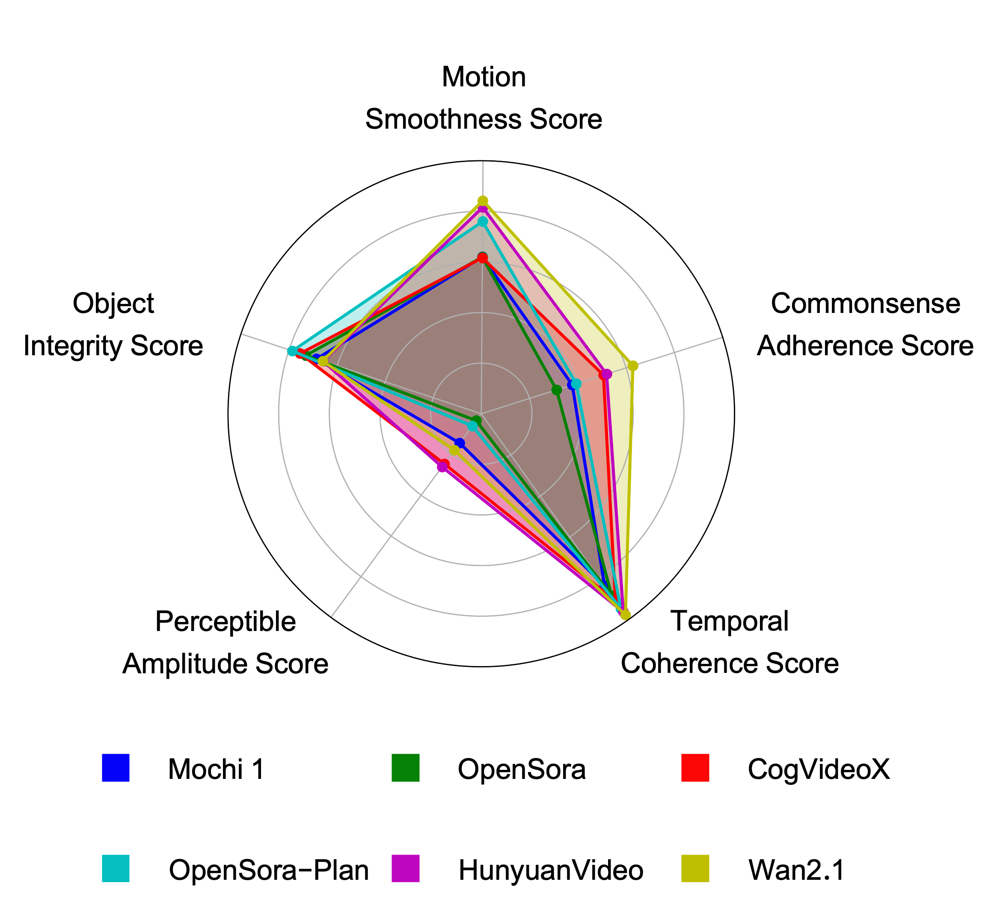

# VMBench: A Benchmark for Perception-Aligned Video Motion Generation

<p align="center">
  
</p>

<p align="center">
          🤗 <a href="https://huggingface.co/GD-ML/VMBench">Hugging Face</a>&nbsp&nbsp | &nbsp&nbsp 📑 <a href="https://arxiv.org/abs/2503.10076">Paper</a> &nbsp&nbsp | &nbsp&nbsp 🌐 <a href="https://gd-aigc.github.io/VMBench-Website/">Website</a>
</p>

# 🔥 Updates

*   \[3/2024\] **VMBench** evaluation code & prompt set released!
    

# 📣 Overview

<p align="center">
  
</p>


Video generation has advanced rapidly, improving evaluation methods, yet assessing video's motion remains a major challenge. Specifically, there are two key issues: 1) current motion metrics do not fully align with human perceptions; 2) the existing motion prompts are limited. Based on these findings, we introduce **VMBench**---a comprehensive **V**ideo **M**otion **Bench**mark that has perception-aligned motion metrics and features the most diverse types of motion. VMBench has several appealing properties: (1) **Perception-Driven Motion Evaluation Metrics**, we identify five dimensions based on human perception in motion video assessment and develop fine-grained evaluation metrics, providing deeper insights into models' strengths and weaknesses in motion quality. (2) **Meta-Guided Motion Prompt Generation**, a structured method that extracts meta-information, generates diverse motion prompts with LLMs, and refines them through human-AI validation, resulting in a multi-level prompt library covering six key dynamic scene dimensions. (3) **Human-Aligned Validation Mechanism**, we provide human preference annotations to validate our benchmarks, with our metrics achieving an average 35.3% improvement in Spearman’s correlation over baseline methods. This is the first time that the quality of motion in videos has been evaluated from the perspective of human perception alignment.

# 📊Evaluation Results

## Gallery


**Prompt:** A tourist joyfully splashes water in an outdoor swimming pool, their arms and legs moving energetically as they playfully splash around.
<table border="0" style="width: 100%; text-align: left; margin-top: 20px;">
  <tr>
      <td>
          <video src="https://github.com/user-attachments/assets/74a0f3b0-6a39-42fe-98de-4a18d4130837" width="100%" controls autoplay loop></video>
      </td>
      <td>
          <video src="https://github.com/user-attachments/assets/7437404c-d732-4e57-9b74-bf1977bc5bfc" width="100%" controls autoplay loop></video>
      </td>
       <td>
          <video src="https://github.com/user-attachments/assets/3ed557d9-99c4-44a6-b218-2a3b9726ad72" width="100%" controls autoplay loop></video>
     </td>
  </tr>
  <tr>
      <td>
          <video src="https://github.com/user-attachments/assets/adf91760-ee43-4dae-8675-d6be9584ef98" width="100%" controls autoplay loop></video>
      </td>
      <td>
          <video src="https://github.com/user-attachments/assets/095d2455-2456-4fdf-a36f-1eee7d3485df" width="100%" controls autoplay loop></video>
      </td>
       <td>
          <video src="https://github.com/user-attachments/assets/bb99eb38-647a-4f79-acf5-527bd8e5a7f3" width="100%" controls autoplay loop></video>
     </td>
  </tr>
</table>


**Prompt:** Three books are thrown into the air, their pages fluttering as they soar over the soccer field, landing in a scattered pattern.

<table border="0" style="width: 100%; text-align: left; margin-top: 20px;">
  <tr>
      <td>
          <video src="https://github.com/user-attachments/assets/5e5432c0-4eb1-40cb-b38d-cb179763d3f8" width="100%" controls autoplay loop></video>
      </td>
      <td>
          <video src="https://github.com/user-attachments/assets/dba7d40c-de5e-4f58-aa2c-4359daa0b358" width="100%" controls autoplay loop></video>
      </td>
       <td>
          <video src="https://github.com/user-attachments/assets/aca77767-98f3-4d63-b186-8b7a5e61a231" width="100%" controls autoplay loop></video>
     </td>
  </tr>
  <tr>
      <td>
          <video src="https://github.com/user-attachments/assets/114c250c-02b1-4755-8f5a-7ab0c2531c6f" width="100%" controls autoplay loop></video>
      </td>
      <td>
          <video src="https://github.com/user-attachments/assets/e4bd1e41-6fc4-48ab-87a1-cb50788a8041" width="100%" controls autoplay loop></video>
      </td>
       <td>
          <video src="https://github.com/user-attachments/assets/ab7e94d4-69c0-47bf-9868-fbd5bcad9b1c" width="100%" controls autoplay loop></video>
     </td>
  </tr>
</table>

**Prompt:** Four flickering candles cast shadows as they burn steadily on the balcony, their flames dancing with the gentle breeze.

<table border="0" style="width: 100%; text-align: left; margin-top: 20px;">
  <tr>
      <td>
          <video src="https://github.com/user-attachments/assets/791fd2ad-0604-4c09-9dde-1eaf5254ea4e" width="100%" controls autoplay loop></video>
      </td>
      <td>
          <video src="https://github.com/user-attachments/assets/b5eca664-8ff2-41aa-9f77-0c30bc0b197f" width="100%" controls autoplay loop></video>
      </td>
       <td>
          <video src="https://github.com/user-attachments/assets/febcd3b3-e391-44c6-8b8e-16703aae28a2" width="100%" controls autoplay loop></video>
     </td>
  </tr>
  <tr>
      <td>
          <video src="https://github.com/user-attachments/assets/3d6006fc-f70a-4b28-a789-5a8d156e5368" width="100%" controls autoplay loop></video>
      </td>
      <td>
          <video src="https://github.com/user-attachments/assets/1c98110c-0372-41ea-864a-57f5f7fdd5c7" width="100%" controls autoplay loop></video>
      </td>
       <td>
          <video src="https://github.com/user-attachments/assets/2aa00829-1894-49b7-8572-42364dc890e5" width="100%" controls autoplay loop></video>
     </td>
  </tr>
</table>

**Prompt:** Two penguins waddle along the beach, occasionally stopping to preen their feathers before continuing their journey across the ocean shore.

<table border="0" style="width: 100%; text-align: left; margin-top: 20px;">
  <tr>
      <td>
          <video src="https://github.com/user-attachments/assets/448a733c-4a76-4186-bf6e-a9c0b0515658" width="100%" controls autoplay loop></video>
      </td>
      <td>
          <video src="https://github.com/user-attachments/assets/ee0c4949-319b-4e6b-a00f-b36d5bffd3f5" width="100%" controls autoplay loop></video>
      </td>
       <td>
          <video src="https://github.com/user-attachments/assets/77fbd9b4-6bb7-4757-865d-0bdc7a93c8a9" width="100%" controls autoplay loop></video>
     </td>
  </tr>
  <tr>
      <td>
          <video src="https://github.com/user-attachments/assets/5bf476c1-707d-45fb-b77e-922b776be221" width="100%" controls autoplay loop></video>
      </td>
      <td>
          <video src="https://github.com/user-attachments/assets/396ac6f7-9073-45b3-9fb1-42e896aae481" width="100%" controls autoplay loop></video>
      </td>
       <td>
          <video src="https://github.com/user-attachments/assets/a92b2a48-b35d-412a-8472-49eca441fbfb" width="100%" controls autoplay loop></video>
     </td>
  </tr>
</table>

**Prompt:** In the bustling street, two kids run towards a small dog, bending down to carefully comb its fur, their hands moving swiftly.

<table border="0" style="width: 100%; text-align: left; margin-top: 20px;">
  <tr>
      <td>
          <video src="https://github.com/user-attachments/assets/235fa02e-0e65-4e23-bfe3-5cfc2f82d7e2" width="100%" controls autoplay loop></video>
      </td>
      <td>
          <video src="https://github.com/user-attachments/assets/d13fd47c-3bfc-44a6-930c-4108e006f9d6" width="100%" controls autoplay loop></video>
      </td>
       <td>
          <video src="https://github.com/user-attachments/assets/0608ee78-9e09-4dad-8563-ad9b8817d188" width="100%" controls autoplay loop></video>
     </td>
  </tr>
  <tr>
      <td>
          <video src="https://github.com/user-attachments/assets/4bb5d304-4e6e-44c4-91b8-81c44513087f" width="100%" controls autoplay loop></video>
      </td>
      <td>
          <video src="https://github.com/user-attachments/assets/30aaab94-bd69-49b1-9334-e44e129c4ee8" width="100%" controls autoplay loop></video>
      </td>
       <td>
          <video src="https://github.com/user-attachments/assets/d701dfcb-aad9-4e38-8ff7-437c57374a31" width="100%" controls autoplay loop></video>
     </td>
  </tr>
</table>

**Prompt:** In the garage, a young girl twirls gracefully, her arms outstretched, perfectly matching the lively country line dance beat.

<table border="0" style="width: 100%; text-align: left; margin-top: 20px;">
  <tr>
      <td>
          <video src="https://github.com/user-attachments/assets/7f379bf0-648d-4fc5-b267-2148b1959eef" width="100%" controls autoplay loop></video>
      </td>
      <td>
          <video src="https://github.com/user-attachments/assets/d371ec05-4c2c-496e-a5be-c8e84229cc5c" width="100%" controls autoplay loop></video>
      </td>
       <td>
          <video src="https://github.com/user-attachments/assets/b0b57156-a7ff-4c0e-b0d7-dca90964edb8" width="100%" controls autoplay loop></video>
     </td>
  </tr>
  <tr>
      <td>
          <video src="https://github.com/user-attachments/assets/837d5a79-d144-469e-9e6a-0d32c129086f" width="100%" controls autoplay loop></video>
      </td>
      <td>
          <video src="https://github.com/user-attachments/assets/103de7c4-608c-4434-a065-c18b74e0e421" width="100%" controls autoplay loop></video>
      </td>
       <td>
          <video src="https://github.com/user-attachments/assets/33a152e6-bc5d-459f-9587-ea2c801dec90" width="100%" controls autoplay loop></video>
     </td>
  </tr>
</table>

## Quantitative Results

<p align="center">
  
</p>
    
### VMBench Leaderboard

<div align="center">

| Models               | Avg      | CAS      | MSS      | OIS      | PAS      | TCS      |
| -------------------- | -------- | -------- | -------- | -------- | -------- | -------- |
| OpenSora-v1.2        | 51.6     | 31.2     | 61.9     | 73.0     | 3.4      | 88.5     |
| Mochi 1              | 53.2     | 37.7     | 62.0     | 68.6     | 14.4     | 83.6     |
| OpenSora-Plan-v1.3.0 | 58.9     | 39.3     | 76.0     | **78.6** | 6.0      | 94.7     |
| CogVideoX-5B         | 60.6     | 50.6     | 61.6     | 75.4     | 24.6     | 91.0     |
| HunyuanVideo         | 63.4     | 51.9     | 81.6     | 65.8     | **26.1** | 96.3     |
| Wan2.1               | **78.4** | **62.8** | **84.2** | 66.0     | 17.9     | **97.8** |

</div>

# 🔨 Installation

## Create Environment

```shell
git clone https://github.com/Ran0618/VMBench.git
cd VMBench

# create conda environment
conda create -n VMBench python=3.10
conda activate VMBench
pip install --upgrade setuptools
pip install torch==2.5.1 torchvision==0.20.1

# Install Grounded-Segment-Anything module
cd Grounded-Segment-Anything
python -m pip install -e segment_anything
pip install --no-build-isolation -e GroundingDINO
pip install -r requirements.txt

# Install Groudned-SAM-2 module
cd ../Grounded-SAM-2
pip install -e .

# Install MMPose toolkit
pip install -U openmim
mim install mmengine
mim install "mmcv==2.1.0"
mim install "mmdet==3.2.0"
cd ../mmpose
pip install -r requirements.txt
pip install -v -e .

# Install Q-Align module
cd ../Q-Align
pip install -e .

# Install VideoMAEv2 module
cd ../VideoMAEv2
pip install -r requirements.txt

cd ..
pip install -r requirements.txt
```

## Download Checkpoints
Place the pre-trained checkpoint files in the `.cache` directory.
You can download our model's checkpoints are from our [HuggingFace repository 🤗](https://huggingface.co/GD-ML/VMBench).
You also need to download the checkpoints for [Q-Align 🤗](https://huggingface.co/q-future/one-align) and [BERT 🤗](https://huggingface.co/google-bert/bert-base-uncased) from their respective HuggingFace repositories

```shell
mkdir .cache

huggingface-cli download GD-ML/VMBench --local-dir .cache/
huggingface-cli download q-future/one-align --local-dir .cache/
huggingface-cli download google-bert/bert-base-uncased --local-dir .cache/
```
Please organize the pretrained models in this structure:
```shell
VMBench/.cache
├── google-bert
│   └── bert-base-uncased
│       ├── LICENSE
│        ......
├── groundingdino_swinb_cogcoor.pth
├── q-future
│   └── one-align
│       ├── README.md
│       ......
├── sam2.1_hiera_large.pt
├── sam_vit_h_4b8939.pth
├── scaled_offline.pth
└── vit_g_vmbench.pt
```

# 🔧Usage

## Videos Preparation

Generate videos of your model using the 1050 prompts provided in `prompts/prompts.txt` or `prompts/prompts.json` and organize them in the following structure:

```shell
VMBench/eval_results/videos
├── 0001.mp4
├── 0002.mp4
...
└── 1050.mp4
```

**Note:** Ensure that you maintain the correspondence between prompts and video sequence numbers. The index for each prompt can be found in the `prompts/prompts.json` file.

You can follow us `sample_video_demo.py` to generate videos. Or you can put the results video named index into your own folder.
    

## Evaluation on the VMBench

### Running the Evaluation Pipeline
To evaluate generated videos using the VMBench, run the following command:

```shell
bash evaluate.sh your_videos_folder
```

The evaluation results for each video will be saved in the `./eval_results/${current_time}/results.json`. Scores for each dimension will be saved as `./eval_results/${current_time}/scores.csv`.

### Evaluation Efficiency

We conducted a test using the following configuration:

- **Model**: CogVideoX-5B
- **Number of Videos**: 1,050
- **Frames per Video**: 49
- **Frame Rate**: 8 FPS

Here are the time measurements for each evaluation metric:

| Metric | Time Taken |
|--------|------------|
| PAS (Perceptible Amplitude Score) | 45 minutes |
| OIS (Object Integrity Score) | 30 minutes |
| TCS (Temporal Coherence Score) | 2 hours |
| MSS (Motion Smoothness Score) | 2.5 hours |
| CAS (Commonsense Adherence Score) | 1 hour |

**Total Evaluation Time**: 6 hours and 45 minutes

# ❤️Acknowledgement
We would like to express our gratitude to the following open-source repositories that our work is based on: [GroundedSAM](https://github.com/IDEA-Research/Grounded-Segment-Anything), [GroundedSAM2](https://github.com/IDEA-Research/Grounded-SAM-2), [Co-Tracker](https://github.com/facebookresearch/co-tracker), [MMPose](https://github.com/open-mmlab/mmpose), [Q-Align](https://github.com/Q-Future/Q-Align), [VideoMAEv2](https://github.com/OpenGVLab/VideoMAEv2), [VideoAlign](https://github.com/KwaiVGI/VideoAlign).
Their contributions have been invaluable to this project.

# 📜License
The VMBench is licensed under [Apache-2.0 license](http://www.apache.org/licenses/LICENSE-2.0). You are free to use our codes for research purpose.

# ✏️Citation
If you find our repo useful for your research, please consider citing our paper:
  ```bibtex
  @misc{ling2025vmbenchbenchmarkperceptionalignedvideo,
        title={VMBench: A Benchmark for Perception-Aligned Video Motion Generation},
        author={Xinrang Ling and Chen Zhu and Meiqi Wu and Hangyu Li and Xiaokun Feng and Cundian Yang and Aiming Hao and Jiashu Zhu and Jiahong Wu and Xiangxiang Chu},
        year={2025},
        eprint={2503.10076},
        archivePrefix={arXiv},
        primaryClass={cs.CV},
        url={https://arxiv.org/abs/2503.10076},
  }
   ```
